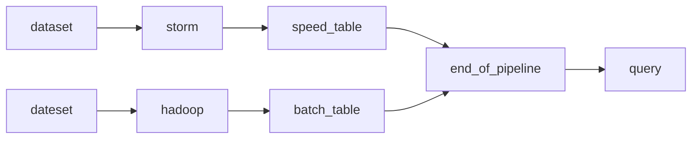

# streaming systems

一个讲述what、where、when和how 处理大量级的数据

## 为什么用流式处理？

### 流式处理的优点

- 低延时
- 有利于处理无休止的数据
- 有利于对资源产生可预测的消耗

### 什么是流？

- 一种处理脑中无穷数据集的数据处理引擎
- unbounded data
- 持续数据处理
- 低延时、近似的、猜测的（speculative）

### 流式处理非常大的缺陷

- 不能得到一致性的结果，CAP？
- 流式处理不要求强一致性

### lambda architecture

- 对时间的推理

### event time vs processing time

- event time，某个时间点某些时间将会发生
- processing time，被系统观测到的事件发生的时间点

## relative

- kafka
- kappa architecture
- [flink](https://flink.apache.org)
- oreilly
- sparking steaming
- [How to beat the CAP theorem](http://nathanmarz.com/blog/how-to-beat-the-cap-theorem.html)
- [Lambda Architecture](https://www.oreilly.com/radar/questioning-the-lambda-architecture/)
- [Apache Storm](http://storm.apache.org)
- [Why local state is a fundamental primitive in stream processing](https://www.oreilly.com/ideas/why-local-state-is-a-fundamental-primitive-in-stream-processing)

## 词汇

- amongst，在。。之中，page7
- crave，渴望
- timely，及时的
- tamed，控制，梳理
- despite，尽管
- immatrue，未成熟的
- due to，由于
- memo，备忘
- terminology，术语
- oft. often的简称
- burden，负担
- implicaton，意义
- approximate，近似
- speculative，投机的
- conversely，反过来
- artifact，神器，人工制品
- relegated，降级
- somehow，以某种方式
- dual，双重
- antiquity，古老的
- skew，倾斜
- impose，加强
- anormal，异常
- dedicated

