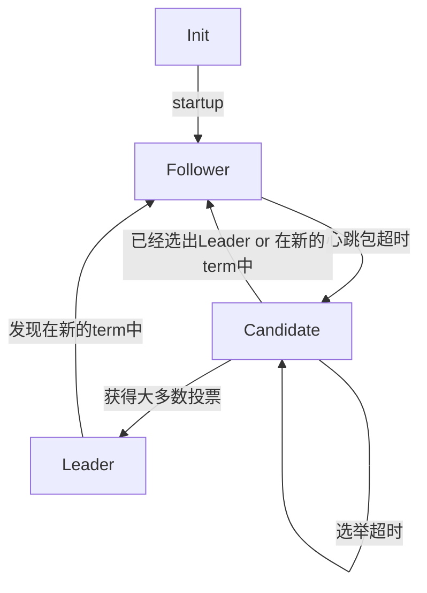

# raft

保证分布式系统的一致性。

- 什么是分布式系统的一致性？
  - 对于一个client来说，他希望连接的分布式系统的每一台主机（可以是大多数主机），所维护的**状态机**的当前状态是一致的
  - client会输入一个**命令**，让分布式系统执行，此时分布式系统的状态机就会从一个状态，变到另一个状态
  - 如何维护一个完整的状态机？这个问题可以转化成：如何让分布式系统执行的log是一致的？因为初始状态都是一样的
- 实际应用过程中，**追加log**可以理解成是某些操作，例如：设置变量

## 状态

在一个term（任期）中，新的term怎么产生的？如果一个follower收到leader的心跳包超时，该follower就进入新的term

## term

- 标识当前任期的一个自增量
- 从一个任期进入下一个任期时，term自增一次

### leader

- 接收客户端请求
- 向follower同步请求日志，包含提交日志

### follower

- 一开始所有节点都是follower，通过一个心跳定时器检查心跳，如果没有心跳则进入candidate状态
  - 实际实现可以先判断当前的follower有没有leader

- 接收leader请求
- 同步日志，提交日志

### candidate

- leader election过程中的临时角色
- 每个candidate都会让别人投自己
  - 所以需要一个机器表用来找到所有机器

## leader election

- 选举过程
- 一次选举可能会超时，然后进入下一个选举
- 不一定是所有节点都能进入下一个term，如果某些节点处于follower，有些节点处于candidate状态，而那些处于follower状态的节点可以和leader保持良好的通信，当candidate恢复网络了，此时candidate进入了new term然后在选举新的leader，导致所有节点选自己做leader
- 半数以上才能做leader，所以如果挂掉了一半以上的节点，分布式系统就无法工作了

## log replication

日志同步与提交，leader向所有Follower发送追加日志请求

- 对于log append这个操作，每个log item都有一个版本号，如果leader发现大多数follower都已经提交了该log item，则leader认为该日志已经提交了

## client

- client向分布式系统通信的过程：发送请求给分布式节点中的某一个节点，如果这个节点是leader，则进行通信，如果这个节点不是leader则返回leader的ip，client再向leader发请求

## heartbeat

- 实现时，follower在处理heartbeat时可以做一些事情，例如：如果当前node的term比leader的大，则可以不处理leader的操作，并返回给leader自己的term，leader会自动变成follower
- 每次收到heartbeat需要重置定时器

## safety

## membership changes

## problem

- 内部网络延时会导致频繁的leader切换

## implementation

- [Vesper](https://github.com/Oaklight/Vesper)，一个提供http接口的python Raft协议实现