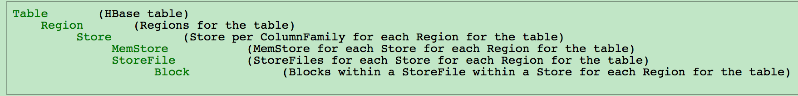
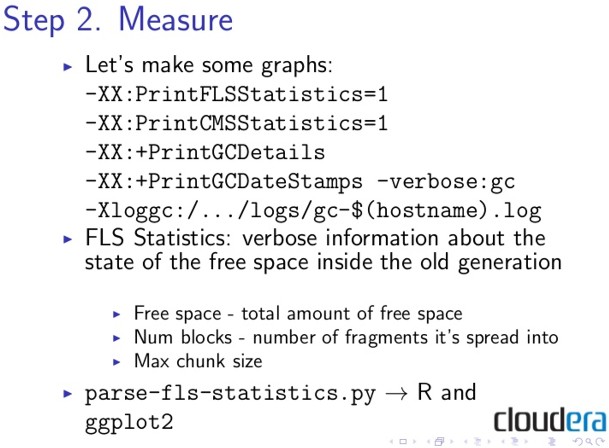

# 拼多多放羊记
- hbae是什么：Sparse(稀疏存储的), Consistent, Distributed, Multidimensional, Sorted map.
### [Physical View](http://hbase.apache.org/0.94/book/physical.view.html)
- 从概念上hbase是一个存储一行一行记录的东西，物理上是按照每个col family存储的。
- 存储是按照timestamp的降序排列的，如果在某个col上是没有值而在同一行的另一个col上是有值的则不会存储没指的那个cell，所以我想其实hbase存储是使用用户的rowkey加上timestamp存储的。
- row的存储是按照字典升序排列的
- column family需要使用可printable的字母表示，而qualifier不需要只需要byte就行了，而且qualifier可以在需要的时候就增加，即时table is enable
- 由于一个column family的tunings and storage的声明在定义的时候就已经完成了，而且一个column family的数据都存储在一起，所以最好一个column family的数据都是格式一样的较好
- puts 的执行如果通过HTable.put则会通过writeBuffer的方式进行，如果HTable.batch则通过non-writeBuffer的方式进行
	- writeBuffer是客户端缓存，用来提供hbase性能的，因为一次写操作其实包含3部分的时间
		- T1 RTT round trip time 客户端发起传输到服务器确认时间
		- T2 put数据网络传输耗时
		- T3 服务器处理时间
	- 设置writeBuffer是用风险的，因为这些数据没有写到WAL上，数据是容易丢失的
	- 每次的put操作实际是hbase client自己计算应该push到那个region server上的[link](http://www.cnblogs.com/panfeng412/archive/2012/10/16/how-to-use-hbase-client-write-buffer.html)
- scan是通过生命keystart和keyend的方式进行scan的
- delete操作在做的时候并不会真正的delete values，之后标记一个墓碑tombstones，values的删除会在一次[major compactions](http://hbase.apache.org/0.94/book/regions.arch.html#compaction)中彻底删除
### [versions](http://hbase.apache.org/0.94/book/versions.html)
- version: milliseconds
- 使用get操作得到的cell是最大的version，但是可能不是最近一个写的记录
- put操作即可以显式的set version，也可以让hbase做set version操作，version有一个ttl清除机制。建议不用timestamp做自己的业务逻辑相关的操作，可以使用而外的字段或则在rowkey中使用timestamp字段
- delete操作默认删除比指定的时间戳更小的所有记录，如果KEEP_DELETED_CELLS这个属性在column family上设置了那么所有被标记成墓碑的记录不会在major compactions中清除，set ttl hbase.hstore.time.to.purge.deletes
- <span style="color:red;">delete的坑</span>, 只能说一点6，如果你删除了一坨记录timestamp<=T，然后很开心的插入一些记录timestamp<=T，好了这个时候并不能get这些记录出来，但是当那些tombstones记录被删了就可以了get了。。，versions这一节可以好好看看，这个page的outer link是最多的。
- 所有的数据操作被返回都是排序的，排序的顺序是row colmnfamily，qualifier，timestamp
- hbase中没有joins操作，只有get或者scan操作，你需要自己通过行键的设计来完成这个join操作，或者运行相关的MapReduce代码
- version number的是通过HColumnDescriptor定义在每个column family上的，default是3，最好版本号不要太大，这会增加storefile的大小，如果设置成0，表示不需要version功能
### [acid-in-hbase](http://hadoop-hbase.blogspot.com/2012/03/acid-in-hbase.html)
- acid: Atomicity, Consistency, Isolation, and Durability
- hbase使用的MVCC实现acid的，并且没有混合读写的事务
- 在每一个regionserver上，事务号是严格的单调递增的
- 当一组puts或者delete操作开始的时候，首先会拿一个WriteNumber，这个是hbase自增当前最大的事务ID的结果
- 当一个scan或者get操作开始的时候，会拿一个最后提交的事务ID，叫做ReadPoint
- 在hbase中一个写事务由一下几个步骤组成：
	1. 锁住自己需要修改的rows
	2. 拿到writenumber
	3. 先写WAL（Write Ahead Log）
	4. 再写memstore（此时会用writenumber标记所写的keyvalues）
	5. 提交事务，比如：将readpoint指向当前的writenumber
	6. 解锁所有的rows
- 读事务会向这样：
	1. 打开一个scanner
	2. 得到当前的readpoint
	3. 过滤出自己所得到的keyvalues，过滤规则是在memstore timestamp>readpoint
	4. 关闭scanner
- 如果你对上述有疑问的话，说明并发编程功底不错。有一下几点保证上处的正确性：
	- hbase保证所有的事务的提交都是串行的。因为hbase中一个事务一般很短。
	- 只有提交了的事务才对读可见
	- hbase会记录所有未提交的事务，保证提交顺序一定是writenumber小的提交在前面
- <span style="color:red;">[官方](http://hbase.apache.org/0.94/book/architecture.html)hbase保证强一致性，我理解hbase不保证一致性，而是最终一致性</span>，额。。。，所以每个region的MVCC只会在每个regionserver上。这里有必要说一些什么是一致性，对于一个特定的rowkey进行的put操作，要么对所有人可见，要么对none可见。从[hbase代码](https://hbase.apache.org/apidocs/org/apache/hadoop/hbase/client/Consistency.html)上看支持两种一致性：
	1. 强一致性：需要读写的数据只在一台机上
	2. Timeline的一致性，这种一致性将不能看到最近更新的数据
- compactions，就是之前提到的major compactions，会把多个小的store file(会把memstore刷到磁盘上)组合起来，并且把垃圾清理掉

### [HBase and Schema Design](http://hbase.apache.org/0.94/book/number.of.cfs.html)
- 当column family的个数大于两个或三个的时候hbase的性能并不好
- ∆ flushing and compaction在column family很多的时候会导致许多不必要的io开销，因为这两个操作时基于每个region server的，所以最好设计成每次只读一个colmn family
- If ColumnFamilyA has 1 million rows and ColumnFamilyB has 1 billion rows, ColumnFamilyA's data will likely be spread across many, many regions (and RegionServers). 这会导致大量的对 ColumnFamilyA 的scans操作导致很差的性能
-  avoid using a timestamp or a sequence as the row-key.因为这样的数据会落在同一个region server上
- 尽量使行键和列族短小，[这很重要](http://hbase.apache.org/0.94/book/regions.arch.html#keyvalue)
- 把rowkey转成bytes，例如一个string每个字符占一个byte但是转成long型的数则只占8个byte，可以小三倍的size
- 想快速找到最近插入的记录吗？可以使用Reverse Timestamps的方式
```java
Long.MAX_VALUE - timestamp
```
你值得拥有
- <span style="color:red;">pre-split region是很重要的</span>，比方说你的rowkey范围是这样的"0000000000000000" to "ffffffffffffffff"这是二进制的范围，但是你所使用的rowkey是可见字符，这就麻烦了，可能很多regionserver用不到，导致热点问题。下面这个方法比较好

```java
public static byte[][] getHexSplits(String startKey, String endKey, int numRegions) {
  byte[][] splits = new byte[numRegions-1][];
  BigInteger lowestKey = new BigInteger(startKey, 16);
  BigInteger highestKey = new BigInteger(endKey, 16);
  BigInteger range = highestKey.subtract(lowestKey);
  BigInteger regionIncrement = range.divide(BigInteger.valueOf(numRegions));
  lowestKey = lowestKey.add(regionIncrement);
  for(int i=0; i < numRegions-1;i++) {
    BigInteger key = lowestKey.add(regionIncrement.multiply(BigInteger.valueOf(i)));
    byte[] b = String.format("%016x", key).getBytes();
    splits[i] = b;
  }
  return splits;
}
```

- 每个hbase单元的存储最好不要超过10M如果是objects的话可以到50M [object store](https://docs.transwarp.io/4.7/goto?file=HyperbaseManual.html#object-store-chapter)
- [counters](http://cloudfront.blogspot.sg/2012/06/hbase-counters-part-i.html)额，看了下api文档，过时了不再维护了，还是用[LongAdder](http://docs.oracle.com/javase/8/docs/api/java/util/concurrent/atomic/LongAdder.html?is-external=true)吧。他们两都是提供对一个row的column做原子的加操作
- 对于delete的cells使用get或者scan操作还是可以得到的，但是会有[delete markers](http://hbase.apache.org/0.94/book/cf.keep.deleted.html)，亲测有效，delete之后只需要在scan的时候加入这样的参数{RAW => true, VERSIONS => 3}即可
- <span style="color:red;"></span>

### [secondary index](http://hbase.apache.org/0.94/book/secondary.indexes.html)
- 先思考这么一个问题，rowkey是这样user-timestamp，这可以很方便的select by user，但这对于select by time则不容易
- Periodic-Update Secondary Index这种做法的意思是再开一张表，利用map-reduce job去做更新。我感觉可以用[coprocessor](https://www.ibm.com/developerworks/cn/opensource/os-cn-hbase-coprocessor1/index.html)的方法去做。
- Dual-Write Secondary Index ---- write to data table, write to index table
- 其实都差不多，感觉可以看一下phonix是怎么实现的

### [mapreduce](http://hbase.apache.org/0.94/book/mapreduce.html)
- [mapreduce编程模型简要介绍](http://www.flyne.org/article/1121)，map读取input映射成key-value，shuffle把map的结果合并和排序，reduce最后的汇总处理。
- 如果有100个region server就会有100个map-tasks，使用[TableInputFormat](http://blog.csdn.net/yanmingming1989/article/details/7011928)可以方便的完成table2mapper对象的转换，也可以自己定义转换格式，只需要继承TableInputFormatBase。可以自己试一下[从hdfs上读文件做mapper再把结果写到hbase中](http://blog.csdn.net/hadoop_/article/details/11538201)。官方有[input是hbase table的例子](http://hbase.apache.org/0.94/book/mapreduce.example.html)操作性不强，毕竟没有环境。
### [security](http://hbase.apache.org/0.94/book/security.html)
- 首先需要开启Kerberos-enabled HDFS daemons，然后在hbase-site.xml配上Kerberos的操作权限
	- [java连接kerberos](https://www.ibm.com/support/knowledgecenter/en/SSPT3X_3.0.0/com.ibm.swg.im.infosphere.biginsights.admin.doc/doc/kerberos_hbase.html)
	- [源码示例](http://www.voidcn.com/blog/mm_bit/article/p-6104605.html)
	- [kerberos配置](http://www.cnblogs.com/morvenhuang/p/4503478.html#b03)
	- [hbase配置kerberos](http://www.cnblogs.com/morvenhuang/p/4536252.html)
- Access Control没看，人工scan了一下，发现权限的控制还是很细的

### [architecture](http://hbase.apache.org/0.94/book/architecture.html)
- scan -ROOT- .META. 查看region server等信息请使用scan 'hbase:meta'
- [有用的filter](http://hbase.apache.org/0.94/book/client.filter.html)，filter工作在服务器端，这个比较好
- HMaster一般运行在namenode
	- LoadBalancer
	- CatalogJanitor周期性的check and clean hbase:meta表
- HregionServer一般运行在datanode
	- CompactSplitThread找到split然后做镜像压缩
	- MajorCompactionChecker check是不是需要major compaction
	- MemStoreFlusher 周期性的把MemStore to StoreFiles.
	- LogRoller 周期性的check Hlog
- Block Cache 对于table的数据在磁盘上是一个一个的block，block需要load进内存，不能用完就扔吧，所以hbase采用LRU（最近最少使用的清除的算法）干这件事，有意思的是hbase和jvm一样划分出Single access，Mutli access和In-memory access三个优先级来区分block cache的重要程度。jvm大约0.85的heap都是这些cache。下面列出哪些数据会在cache中：
	- Catalog tables: The -ROOT- and .META. tables
	- HFiles indexes：因为HFile是hbase数据持久化的文件格式，为了快速找到数据而不是把整个HFile都load到内存就需要index喽
	- Keys：没错就是rowkey+column family+qualifier+timestamp，所以需要设计的rowkey比较小也是合理的
	- Bloom filters：为了快速检查一个key是否在hbase中存在。bloom filter可以比一般的hash方法少用7/8的空间，因为它用了两个hash函数
- HFile indexes and bloom filters sizes可以在Web UI上查到
- WAL这是个好东西，可以看看[wiki的文章](http://en.wikipedia.org/wiki/Write-ahead_logging)

### [regions](http://hbase.apache.org/0.94/book/regions.arch.html)
- 存储的结构


- region-size 可能一个region会在多个regionServer上，也可能一个regionServer上有多个region，比如三台机有12个region，第一台可能有3个，第二个有4个，第三台有5个，当后面两台停止工作了，第一台机有12个

- region-regionServer Assignment region是如何赋给regionserver的
	1. Master在startup的时候调用AssignmentManager
	2. AssignmentManager check META，就是region和regionserver的对应关系
	3. 如果regionserver不可用了就由LoadBalancerFactory随机选取一个regionserver把region赋出去
	4. META会在regionserver的选取和regionserver start的时候被修改
- Failover 当regionServer不可用时region-regionServer Assignment就会启动
- [LoadBalancer](http://hbase.apache.org/0.94/book/master.html#master.processes.loadbalancer) region可能会被LoadBalancer给移除
- 数据冗余策略
	1. First replica is written to local node
	2. Second replica is written to another node in same rack
	3. Third replica is written to a node in another rack (if sufficient nodes)
- region split 可以独立在一个regionServer上run，不需要master的参与，regionServer自己可以分离一个region并且把这个split离线，之后将相关信息写到META表中，最后把这些信息告诉master，[手动分离region](http://hbase.apache.org/0.94/book/important_configurations.html#disable.splitting)

- HFile
	- view HFile ${HBASE_HOME}/bin/hbase org.apache.hadoop.hbase.io.hfile.HFile -v -f hdfs://hadoop-master:8020/hbase/some_file
	- [HFile in hdfs](http://hbase.apache.org/0.94/book/trouble.namenode.html#trouble.namenode.hbase.objects)
- Compaction 有两种Compaction，一种是minor一种是major，minor只会将一个store上的所有小的storefile合成一个，major做删除墓碑记录。有时minor会转化成major。一次major compaction可能会把一个store上的所有数据重新写一遍，这是不可避免的，major在一个大型系统上可能需要手动触发
- Compaction File Selection算法，官网有很多例子，表示没看懂是个什么选择原理，貌似需要去bigtable论文中看看什么原理
- [bulkload的方式向hbase导入数据](https://my.oschina.net/leejun2005/blog/187309)

### HDFS
- namenode 维护文件系统的元数据metadata
- datanode 存储HDFS的block
- [一坨filter](http://hbase.apache.org/0.94/book/thrift.html)
### performance tuning，我也开始学着官方文档装b了，其实就是性能调优
- Set swappiness to 0，为什么？因为这样可以避免让kernel将运行着的进程换到磁盘上
- bigger heap for good block cache hit rate and memstore efficient flush, but for longer GC 

### Java GC - CMS(concurrent mark and sweep)
- Java heap 可以分成两种 young or old
- for young -XX:+UseParNewGC(parallel new gc); for old -XX:+UseConcMarkSweepGC
- parallel new gc的工作方式
	1. young generation分为 eden（所有刚new的对象），survivor-0（from-space），survivor-1（to-space），并行GC会每隔一段时间 check一次eden是否满了，满了就进行stop-the-world的GC
	2. stop-the-world的GC：从eden和from-space中copy所有的活着的对象到to-space中，交换from-sapce和to-space
	3. 这里会进行计数如果在每一轮的GC过程中一些被往返copy了n次的对象会被移到old generation
- CMS的工作方式
	1. initial mark（STW）暂停整个程序从thread stacks开始标记，这个mark称为root mark
	2. concurrent mark 并行的从root mark开始向下追溯标记
	3. concurrent preclean 并行的开始预清理，这时候可以发现哪些是垃圾，哪些是需要移至old generation的对象
	4. remark（STW）暂停整个程序的葱root mark开始重新标记
	5. concurrent-sweep 并发清理remark过程中标记的所有垃圾
- CMS的失败处理方式，这两点很危险
	1. old generation空间不够导致GC失败，就设置这个参数-XX:CMSInitiatingOccupancyFraction比如60%-70%，就是说在old generation还剩60%-70%的空间的时候就开始GC
	2. old generation出现内存碎片化，这个时候就需要stop-the-world开始compact space to contiguous
- 如果推测CMS的GC错误是什么导致的，如果你已经调整小了参数但是GC pause还是很长，明显就是第二种内存碎片化了
- 打开一些统计debug


- 平凡的write容易造成fragmentation，基于LRU的read不容易造成
作者好坏坏，看着我都饿了
- MSLAB MemStore Local Allocation Buffer
	- 设置hbase.hregion.memstore.mslab.enabled to true可以缓解内存碎片，但是很容易造成OOME
	- 所以需要明白原理，貌似是用了一个atomic的buffer叫做chunk，一个chunk 2M，然后KeyValue写的时候先写到chunk里，在把chunk的ref给memstore，flush memstore就清掉chunk就可以了，我说了些啥？[link](http://www.slideshare.net/cloudera/hbase-hug-presentation)


### vocabulary
- Monotonically单调的
- metric_type计量类型
- mutable可变的
- Smackdown打倒
- spit吐出
- sink下沉
- Roll 滚动
- rack 机房鸡架
- unaided 独立的
- dread 恐惧
- sucks 吸，oh life sucks！我不信是吸的意思，应该是爆炸的意思💥
- hypothsize 推测
- recap 总结
- seldom 很少
- chunk 区间，块
- swiss 瑞士


