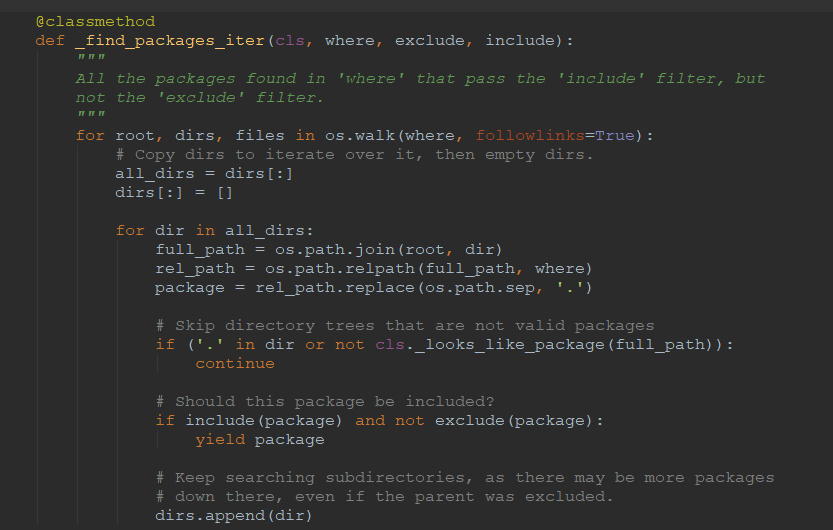

# gevent

- 阅读源码的方法：借助git阅读，先切到最开始的版本（tag），再读每个版本的diff
  
- 有文档则先读文档（每个tag的changes），然后读test，直接读整个项目的话，不了解作者的设计思路会云里雾里的
  
  - 获取所有按version排序的tag
  
    ```bash
    git tag --sort=version:refname
    ```
  
  - 获取当前version的上一个version
  
    ```bash
    git log --reverse --ancestry-path HEAD..master | head -n 1
    ```
  
  - 获取第一个commit version
  
    ```bash
    git log --reverse | head -n 1
    ```
  
- source tree对比版本

  

- 阅读源码的好处

  - 可以体验一波别人都是怎么骚断腿地用python（newsock = type(self)(sock) # 包装sock成GreenSocket，patch）
  - 别人已经造好的轮子，为我所用（比如：如何写个python后门）
  - 通过优秀源码学习，别通过google出来的博客学习地更深入（调试使用%r）
  - 了解大牛是在python版本更迭中，如何兼容不同版本的python的（2.4的socket._fileobject的close方法实现与2.6的不同，2.4的close前没有flush，令人头秃的问题）

- linux mutex（互斥锁），只有获取了互斥量的native线程能执行

- GIL，CPython实现的时候，防止native thread同时执行bytecode的一个mutex，CPython实现的内存管理是非内存安全的。而且，GIL的实现可以概括为以下代码，每个native线程执行前都需要获取一发GIL锁。为什么不解决呢？因为某些库已经依赖了，所以就犹如一个bug般存在

```python
while True:
    acquire GIL
    for i in 1000:
        do something
    release GIL
```

- python语言的好处在于，它是个prototype，实现的逻辑也比较容易看懂，而写程序是必须阅读源码的，因为单单从函数名参数和返回值上很难确定这个函数具体干了什么，总是会有一些隐含逻辑需要通过源码看到
- 研发的本质：了解需求->转化代码，了解需求：能够想出一个非常具体的功能，转化代码：确认实现，推演过程，编写代码
- 了解一个库的本质：具体完成了什么功能？怎么做的？需要怎么用？
  - 一个东西是有什么组成的？
  - 每个部分又是怎么通信合作的？
- 如何才能自动生成代码？需求->软件（代码），绝大多数需求github上一定是有的，可能自己也是做过的，但是因为需求上的差异造成需要把轮子再造一遍。比如findpackages里的这一段，我在网易不知道写了多少遍。
  - 通过继承的方式或许是一个好方式，不过这个总是需要不断更改原来的代码结构确保可以兼容当前和之前的功能
  - 所以，所有公司都通过确保招聘的人可以很好的搬砖来解决这种矛盾
- 看源码的时候先想想，自己是怎么实现的，再看看作者是怎么实现的
- 整体感觉是，通过协程管理器hub管理协程，整个运行过程比较复杂，不易一眼看懂代码是怎么跑的

```python
    def test_multiple_waiters(self):
        evt = coros.event()
        value = 'some stuff'
        results = []
        def wait_on_event(i_am_done):
            evt.wait()
            results.append(True)
            i_am_done.send()

        waiters = []
        count = 5
        for i in range(count):
            waiters.append(coros.event())
            gevent.spawn(wait_on_event, waiters[-1]) # 启动5个wait
        evt.send() # 触发之前的5个wait执行成功

        for w in waiters:
            w.wait() # 等待所有i_am_done消息，这是实际是同步等待，配合timeout测试还是比较完美的

        self.assertEqual(len(results), count)
```

- posix，dup函数，复制文件描述符，两个文件描述符彼此独立，并且共用同一个内核的文件描述符表，其中一个close了，不影响另一个
- 写基础组件，感觉唯一的动力就是通过测试驱动开发的方式
- 以前在网易的时候服务器就是用libevent+python写的，python负责逻辑，C++写引擎（游戏引擎的某些库服务端也需要用），当时C++提供python的timer库非常好用，也是封装libevent实现的，当时找了一下，python的timer居然是用threading实现的，就想自己去封装一把，然后libevent需要main loop运行，自己就放弃了
- 不但要写正常功能的测试，还要写异常功能的测试，保证代码在正常情况和异常情况都是符合预期的
  - 例如：对于monkey patch的测试，基本把socket库全测试了一遍，包括：urllib2，socket监听等等
- 关于if elif else的判断问题，当有很多情况需要判断时，首先应该将筛选条件分配，最外面的判断主分支应该是最能区分情况的分支，每个逻辑分支里面再写分支逻辑判断、
- 很多tag的版本其实都是在优化代码和修复bug，并没有做新功能
- 看完两个三个tag后，不经陷入思考，一共有74个tag，假设每天可以看1个tag也需要74天才能看完，所以如果想快的话可以跳过小版本的tag，直接对别大版本的tag看，对应的changes也需要自己合并以后看

## initial commit

- 这个是gevent提交的源码的第一版，从example中可以看出第一版实现了一个网络库，eventlet（事件小库？），通过协程实现把blocking的操作转变成non-blocking的

- gevent依赖greenlet和libevent实现，用greenlet做协程，libevent做non-blocking-io

    - 协程其实很好理解，只要把它看做是函数就可以了，只是函数的调用栈是系统控制的，协程的调用栈是程序控制的
    - 基于libevent的NIO需要在应用程序中显示的调用event_dispatch（现在已经叫event_base_dispatch了），gevent想屏蔽调这个调用

- libevent

    - time事件，把事件按触发的时间顺序排列，用小顶堆实现
    - read事件，可读事件很简单，缓冲区有数据可读
    - write事件，可写事件只能在需要写的时候，把事件进行注册，当缓冲区低于某个水位线就进行写

- gevent的执行流程可以描述成：执行一段代码（用户定义的协程），通过Hub.switch一次选取一些ready的事件，并执行这些ready事件的触发函数，再把程序控制权交给用户自定义的协程，如果用户自定义的协程不通过switch方法把程序控制权交给gevent，那么gevent就会卡住

- coros.py是对协程的应用，作者用gevent实现了，event、Queue、Channel和Semaphore等系统库

- setup文件

  - glob库，一个python的find命令
  - setup，packages，find_packages，exclude，看了半天英文才理解原来这个的意思是：setup的package不包含greentest的包

  - 所以函数，只要搞清楚他是做什么的，输入和输出参数的含义就好了，从这一点上说python确实不是什么好东西，因为从函数定义上无法得知这个函数的输入和输出，特别是类型

  

  - MANIFEST.in，通过sdist（source distribute）时包含setup中未包含的文件，所以作者是想如果通过sdist安装则保留test文件吗？

- examples

  - wsgi，wsgi由web server和web app组成，每个web app可以是一个中间件
  - os，一个实现posix协议的模块，里面有文件是否access，chmod，chown等等linux命令的定义
  - 继承unittest.TestCase，customize自己的功能，值得学习
  - testall，通过python glob到所有的test_*.py通过命令完成test

- doctests，大佬写东西就是不一样，这里还会对doc中出现的example进行测试

- pyx，[cython语法](https://lijin-thu.github.io/07.%20interfacing%20with%20other%20languages/07.04%20cython%20part%202.html)
  - python调用cython有几种方式，简单的方式就是上面的链接中的方式了，通过编译成so文件
  - 将pyx文件通过cython生成为c文件，通过setup的方式也可以引用，作者用的就是这种方式，貌似这种方式比较好处理对c的调用

- [gevent是如何隐藏libevent的main loop的？](https://blog.csdn.net/windeal3203/article/details/52770759)调用libevent时，实际是应用程序有一个main loop，在这个main loop里，libevent select出ready的event，触发之前定义的处理函数运行，隐藏掉main loop之后呢？答案就隐藏在Hub.switch中

- gevent.Hub，switch，协程的原则：dont call switch it

    - Hub.switch把run函数包装在一个协程中运行，而run函数本身只把event进行dispatch
    - 校验当前协程是否为Hub初始化所定义的run函数所在的协程，run函数所在的协程无法切换到本身
    - run函数使用while True的方式运行，所以当别的协程运行完切回来，会继续event_dispatch

- core.timer，通过libevent的evtimer_set实现，通过timer定义的协程运行的时机，一定是在调用Hub.switch之后

- gevent.sleep，在second秒之后，调用当前协程的swtich方法切换

    - 先定义一个second秒执行执行的timer，second秒之后就会唤起当前协程
    - 调用hub.switch切换，该方法会唤起timer的执行
    - 调用sleep(0)实际就是调用了一次hub.switch，之前排队的协程都会被依次执行，最后切换回当前协程

- gevent.spawn，通过timer和greenlet实现，将function包装成greenlet协程，传递的time参数为0，在libevent注册一个事件，这个协程在下一次调用Hub.switch是调用完成

- threadlocal
    - get_hub，初始化hub，每个线程一个hub，hub的设计思路是：[协作式任务调度](https://segmentfault.com/a/1190000000613814)，即把当前的执行栈和某个事件做绑定，然后把执行权交出去，libevent在事件触发后尽快触发事件的执行（即把执行权又交还给原来的执行栈）
    - 这一点可以从timer和spawn的实现上得到印证，timer是直接交给libevent调度，时间到了以后由libevent回调，spawn则将timer进行了一次包装
    - 而IO的异步则变成了read/write事件的ready
    - greenlet，据说python的生成器是半协程，greenlet是真协程，greenlet来自C语言的一个扩展。协程实际就是函数，线程是由系统调度的，协程是由用户自己调度的
    - patch，在geventtest里看到了一段patch的核心思想，不修改原有类代码的情况下，增加原有类的功能
    
    ```python
    _original_Hub = gevent.Hub
    class CountingHub(_original_Hub):
        switch_count = 0
        def switch(self):
            self.switch_count += 1
            return _original_Hub.switch(self)
    gevent.Hub = CountingHub
    ```
    
- socket异步，accept

  - monkey（模仿） patch

	```python
	_socket = __import__('socket')
	_original_socket = _socket.socket
	class GreenSocket(object):
		def __init__(...):
	        ...
	        set_nonblocking(fd)
          ...
  ```

	- accept的异步
	
	```python
	def accept(self):
		if self.act_non_blocking:
			return self.fd.accept()
		fd = self.fd
		while True:
			res = socket_accept(fd) # 要么直接可以读，要么ready后由hub.switch回来
			if res is not None:
				client, addr = res
			set_nonblocking(client)
				return type(self)(client), addr
			wait_reader(fd.fileno(), timeout=self.gettimeout(), timeout_exc=timeout)
	
	```

	- socket_accept
	
	```python
	def socket_accept(descriptor):
	    try:
	        return descriptor.accept()
	    except error, e:
	        if e[0] == errno.EWOULDBLOCK: # 操作将会阻塞
	            return None
	        raise
	```
	
	- wait_reader
	
	```python
	def wait_reader(fileno, timeout=-1, timeout_exc=TimeoutError):
	    evt = core.read(fileno, _wait_helper, timeout, (getcurrent(), timeout_exc))
	    try: 
	        returned_ev = get_hub().switch() # 协程切换，当read事件ready，由其他协程切换回来
	        assert evt is returned_ev, (evt, returned_ev)
	    finally:
	        evt.cancel() # unregister掉之前注册的read事件
	```
	
	- core.read
	
	```python
	cdef class read(event):
	    def __init__(self, int handle, callback, timeout=-1, arg=None):
	        event.__init__(self, EV_READ, handle, callback, arg)
	        self.add(timeout)
	```
	
	- class Hub
	
	```python
	class Hub(object):
	
	    def __init__(self):
	        self.greenlet = Greenlet(self.run)
	        self.keyboard_interrupt_signal = None
	
	    def switch(self): # 将libevent.dispatch方法包装成协程运行，将添加的event dispatch出去
	        cur = getcurrent()
	        if self.greenlet.dead:
	            self.greenlet = Greenlet(self.run)
	        return self.greenlet.switch()
	
	    def run(self, *args, **kwargs):
	        while True:
	            result = core.dispatch()
	            if result>0:
	                return 'Hub.run() has finished because there are no events registered'
	            elif result<0:
	                return 'Hub.run() has finished because there was an error'
	            return result
	```
	
	- _wait_helper
	
	```python
	def _wait_helper(ev, fd, evtype):
	    current, timeout_exc = ev.arg
	    if evtype & core.EV_TIMEOUT:
	        current.throw(timeout_exc)
	    else:
	        current.switch(ev)  # 切换回wait_reader的switch的地方
	```
	
	- core.event
	
	```python
	cdef class event:
	    cdef event_t ev
	    cdef object _callback, _arg
		# evtype注册的事件类型，handle就是fd，callback和arg是回调函数和参数，对于event的回调arg无用
	    def __init__(self, short evtype, int handle, callback, arg=None):
	        self._callback = callback
	        self._arg = arg
	        cdef void* c_self = <void*>self
	        if evtype == 0 and not handle:
	            evtimer_set(&self.ev, __event_handler, c_self)
	        else:
	            event_set(&self.ev, handle, evtype, __event_handler, c_self)
	```
	
	- core.__event_handler
	
	```python
	cdef void __event_handler(int fd, short evtype, void *arg) with gil:
	    cdef event ev = <event>arg
	    try:
	        ev._callback(ev, fd, evtype)
	    except:
	        ...
	```

- accept到client socket的处理

```python
    def dup(self, *args, **kw):
        sock = self.fd.dup(*args, **kw) # 复制文件描述符
        set_nonblocking(sock) 
        newsock = type(self)(sock) # 包装sock成GreenSocket
        newsock.settimeout(self.timeout)
        return newsock
```

- 大佬也存在复制一下改一改的操作，而不是包装一个函数


- gevent的价值，在一个函数内完成了server的监听和client的连接

```python
    def test_connect_tcp(self):
        def accept_once(listenfd):
            try:
                conn, addr = listenfd.accept()
                fd = conn.makeGreenFile()
                conn.close()
                fd.write('hello\n')
                fd.close()
            finally:
                listenfd.close()

        server = socket.tcp_listener(('0.0.0.0', 0))
        g = gevent.spawn(accept_once, server)
        try:
            client = socket.connect_tcp(('127.0.0.1', server.getsockname()[1]))
            fd = client.makeGreenFile()
            client.close()
            assert fd.readline() == 'hello\n'
            assert fd.read() == ''
            fd.close()
        finally:
            gevent.kill(g)
```

- socket.connect，连接实际上是等待一个可写事件，通过wait_writer实现

- 如何将socket包装成ssl_socket

```python
def wrap_ssl(sock, certificate=None, private_key=None): # XXX order of arguments is different from socket.ssl ?
    from OpenSSL import SSL
    context = SSL.Context(SSL.SSLv23_METHOD)
    if certificate is not None:
        context.use_certificate_file(certificate)
    if private_key is not None:
        context.use_privatekey_file(private_key)
    context.set_verify(SSL.VERIFY_NONE, lambda *x: True)

    connection = SSL.Connection(context, sock) # 从一个fd包装成另一个fd
    connection.set_connect_state()
    return GreenSSL(connection)
```

- socket.GreenPipe，像包装socket一样包装了pipe，当读写r/w pipe_fd时，通过libevent调度成nonblocking的

```python
class Pipe: # 通过管道使程序逻辑更加清晰
    def __init__(self, func):
        self.func = func
 
    def __ror__(self, other):
        return self.func(other)
@Pipe
def add(args):
    return sum(args)
@Pipe
def incr(arg):
    return arg + 1
 
print [1, 2, 3] | add | incr
```

- coros.event，任意数量的协程可以等待另一个协程的事件完成，使用：

```python
res=wait(); res=wait() # wait通过hub.switch实现，这两个wait可以在不同的协程中
send(res) # 发出一条消息，并唤醒之前的waiter
```

- fd.read和fd.write具体是调用了哪个系统api读写的，通过fd.recv进行读，fd.write进行写

```python
import fcntl
fileno = fd.fileno()
flags = fcntl.fcntl(fileno, fcntl.F_GETFL) # 获取原先的flags
fcntl.fcntl(fileno, fcntl.F_SETFL, flags | os.O_NONBLOCK) # 增加一个新的flag
```

```python
def read(self, size=None): # 从fd中读取一段字节流的实现，recvbuffer用于缓存多读的字节
    if size is not None and not isinstance(size, (int, long)):
        raise TypeError('Expecting an int or long for size, got %s: %s' % (type(size), repr(size)))
    buf, self.sock.recvbuffer = self.sock.recvbuffer, ''
    lst = [buf]
    if size is None:
        while True:
            d = self.sock.recv(BUFFER_SIZE)
            if not d:
                break
            lst.append(d)
    else:
        buflen = len(buf)
        while buflen < size:
            d = self.sock.recv(BUFFER_SIZE)
            if not d:
                break
            buflen += len(d)
            lst.append(d)
        else:
            d = lst[-1]
            overbite = buflen - size
            if overbite:
                lst[-1], self.sock.recvbuffer = d[:-overbite], d[-overbite:]
            else:
                lst[-1], self.sock.recvbuffer = d, ''
    return ''.join(lst)
```

- coros.queue，一个任务等待队列，实现了协程的生产者消费者模型，消费者通过wait方法等待队列中的消息，wait方法会判断当前是否有消息，如果有则pop出一条给消费者，没有则消费者进入等待；生产者通过send方法发送消息，send函数会唤醒其中一个正在等待的消费者，而其他消费者会继续等待
  - 作者还实现了发送exception的功能
  - 这个实现有个缺陷，就是通过gevent.spawn定义的waiter不能直接出发执行，需要通过gevent.sleep(0)触发
- coros.Channel，一个带max_size的channel，主要实现了可定义最大消息数的coros.event
  - 通过协程实现的channel有点难理解，因为在send会触发wait执行，在wait的时候会触发send执行，同时还需要记录sender和waiter
  - 例如：在wait之后（相当于消费掉了一个消息），需要唤醒一些sender，让sender协程能继续send
- coros.Semaphore，用于实现线程锁

- monkey patch，这个版本patch了os.fork，time.sleep

```python
def patch_socket(): # patch socket库的例子
    from gevent.socket import GreenSocket, fromfd, wrap_ssl, socketpair
    _socket = __import__('socket')
    _socket.socket = GreenSocket
    _socket.fromfd = fromfd
    _socket.ssl = wrap_ssl
    _socket.socketpair = socketpair
```

- os.fork的时候，由于已经是不同的进程了，所以需要重新初始化libevent
  - core.init/reinit，这也是为什么进行fork的时候需要reinit
  - 奇怪的是pyrpc并没有直接进行gevent.patch，而是自己在fork进程的时候进行reinit


- python的BaseHTTPServer，第一次看到原来通过socket实现一个http server原来name简单，感谢python为我屏蔽掉了很多语言上的无用信息
- gevent.proc，协程实现的进程（并不是多进程，而是虚拟的进程），貌似在最新的gevent里已经移除了，也可能改头换面了
  - gevent的Hub协程管理器相当于任务管理器
  - proc虚拟进程相当于一个执行任务的进程
  - 如何获取任务执行结果？通过proc.link
- gevent.proc.Source，维护了一个监听者的链接池，通过源发出的事件能被源分发到每一个监听者
- gevent.proc.Proc，通过Source实现的一个可链接的执行协程，当任务完成，会自动通知所有的监听者
  - 可以传递一个协程，当完成后，监听者会收到一个LinkedCompleted的exception
- gevent.proc.Pool，工作协程池，通过coros.Semaphore协程信号量实现池的大小
- 如何在协程中进行同步，如果是线程，就是用mutex就可以了

```python
class Waiter(object):

    def __init__(self):
        self.greenlet = None

    def send(self, value=None):
        """Wake up the greenlet that is calling wait() currently (if there is one).
        Can only be called from get_hub().greenlet.
        """
        assert gevent.getcurrent() is gevent.get_hub().greenlet
        if self.greenlet is not None:
            self.greenlet.switch(value)

    def send_exception(self, *throw_args):
        """Make greenlet calling wait() wake up (if there is a wait()).
        Can only be called from gevent.get_hub().greenlet.
        """
        assert gevent.getcurrent() is gevent.get_hub().greenlet
        if self.greenlet is not None:
            self.greenlet.throw(*throw_args)

    def wait(self):
        """Wait until send or send_exception is called. Return value passed
        into send() or raise exception passed into send_exception().
        """
        assert self.greenlet is None
        current = gevent.getcurrent()
        assert current is not gevent.get_hub().greenlet
        self.greenlet = current
        try:
            return gevent.get_hub().switch()
        finally:
            self.greenlet = None
```

- 多继承如何初始化，或调用父类方法？
  - 初始化本应该通过super方法完成，但是，看了这个代码，其实可以直接通过super_cls.method(self)的方式调用

## tag 0.9.1

- 将init.py中的greenlet类库移动到greenlet.py
- InteractiveConsole，read-eval-print
  - SocketConsole，通过协程实现的一个tcp-python后门，通过gevent.tcp_listener和gevent.tcp_server实现
  - tcp_listener，绑定端口并返回socket fd
  - tcp_server，accept，协程处理
- 兼容了python2.6和python2.4
- 优化了hub.switch中的core.dispatch出错问题，这个修复只是简单的重试15次，这个实现作者表示再也不会出现问题了。。。

## tag 0.9.2

- 改进了GreenSocket重写了GreenSSL
  - 改进了GreenSocket的所有recv方法，统一写成先wait_reader，再进行read
- core.active_event，优化了gevent的整体速度，因为之前用的是timer，只是把timer加到事件队列里面，并激活事件
  - 在spawn函数里替换掉了原来的core.timer为core.active_event，其实我之前就觉得怪怪的，不过如果不知道event_active api，我也会用timer的方式实现
  - active_event可以优化timer的理解，原本timer是add一个时间为0的timer触发器，但时间为0的事件本身需要被libevent放入事件队列、选择事件、激活事件、调度事件触发器，直接通过active_event可以直接到激活事件那一步
- RunningProcSet，Proc管理器，当Proc结束后，会删除该对象

## tag 0.9.3

- 重新实现了Queue，之前实现的Queue并不是完全兼容标准库的，直接通过collections.deque实现而不依赖coros.Queue实现
  - 但这样造成了冗余代码？为啥不把coros.Queue改成标准库api？因为如果这样改之前所有依赖coros.Queue的代码都需要改。。。所以，在changelog了作者写了需要deprecate掉Queue和Channel（读者和作者的心意吻合了，异常舒爽）
  - 另一个问题是，这个Queue并不是一个先进先出的一个Queue（一个是因为set的pop是随机的，另一个是循环调度的实现导致），不知道作者怎么想的
  - 里面的get和put操作相当经典，我看过的两个协程框架都是这么实现的（之前那个是multitask），通过协程实现的框架不是很好理解，因为实现get和put操作不是简单的去get和put操作数据结构，而是需要先做一些别的事情
  - 调度，使用这是_event_unlock对象进行调度，调度完设置为None
    - 循环调度：如果队列中有元素，并且有getter，则get一个元素通过getter.switch的方式传递过去，如果前一个条件不满足，且有putter和getter，则直接把putter中的item给getter（这个情况可能是想兼容Queue的size为0的情况），先switch到getter，再switch到putter，如果前两个条件不符合，但是当前有putter并且当前队列未满，则可以进行put
  - get操作
    - 如果队列中有元素（如果此时有putter，则先调度一波，这个逻辑其实很别扭），再从队列中直接pop返回
    - 如果是get_no_wait的，如果队列有元素则走第一种情况，如果队列为空，则看现在有没有putter，如果有putter，则从putter中挑一个出来给
    - 如果是get_wait的，则把当前getter加入等待列表，如果当前有putter，则先调度一波，再getter进入等待，而调度的过程又会先处理之前的getter列表，反正感觉逻辑很乱。。。
  - put操作，和get操作差不多
- 修复了select的timeout问题。。。这个select里的timeout参数不就摆设吗？
- spawn和spawn_later性能问题，只是把“闭包”改成了直接调用就能提升50%的性能？

```python
# 改进前
def spawn(function, *args, **kwargs):
    g = Greenlet(lambda : function(*args, **kwargs))
    g.parent = get_hub().greenlet
    core.active_event(g.switch)
    return g
def spawn_later(seconds, function, *args, **kwargs):
    g = Greenlet(lambda : function(*args, **kwargs))
    g.parent = get_hub().greenlet
    core.timer(seconds, g.switch)
    return g
# 改进后
def _switch_helper(function, args, kwargs):
    # work around the fact that greenlet.switch does not support keyword args
    # 当时的Greenlet.switch还不支持kwargs
    return function(*args, **kwargs)
def spawn(function, *args, **kwargs):
    if kwargs:
        g = Greenlet(_switch_helper, get_hub().greenlet)
        core.active_event(g.switch, function, args, kwargs)
        return g
    else:
        g = Greenlet(function, get_hub().greenlet)
        core.active_event(g.switch, *args)
        return g
def spawn_later(seconds, function, *args, **kwargs):
    if kwargs:
        g = Greenlet(_switch_helper, get_hub().greenlet)
        core.timer(seconds, g.switch, function, args, kwargs)
        return g
    else:
        g = Greenlet(function, get_hub().greenlet)
        core.timer(seconds, g.switch, *args)
        return g
```

## tag 0.10.0

- timeout api的优化，作者描述成不向后兼容的更新，其实还好，也就是在enter的时候才start timer而已，不过直接把Timeout类作为抛出异常的类还是很骚的
- 扩展了greenlet类的方法，通过继承override、新增等方式实现
  - link，终于把之前的“协程进程任务”实现的link通过方法的方式暴露出来了，也是优化了gevent的用法，实际就是注册了一个回调函数