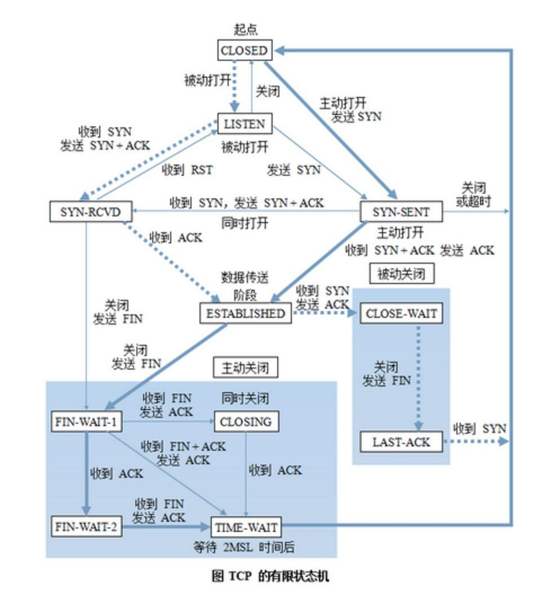
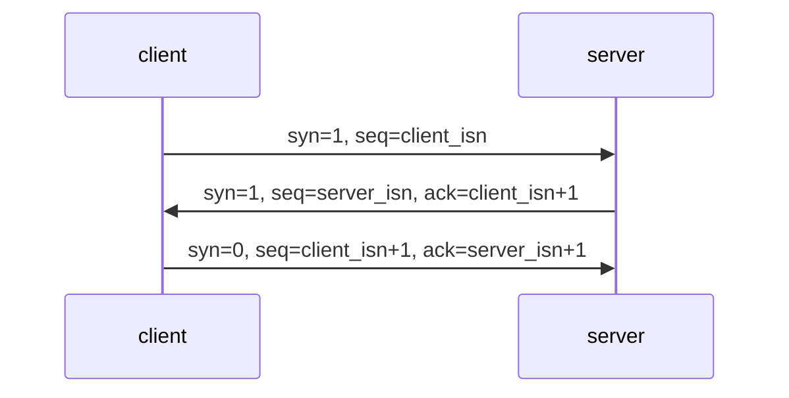
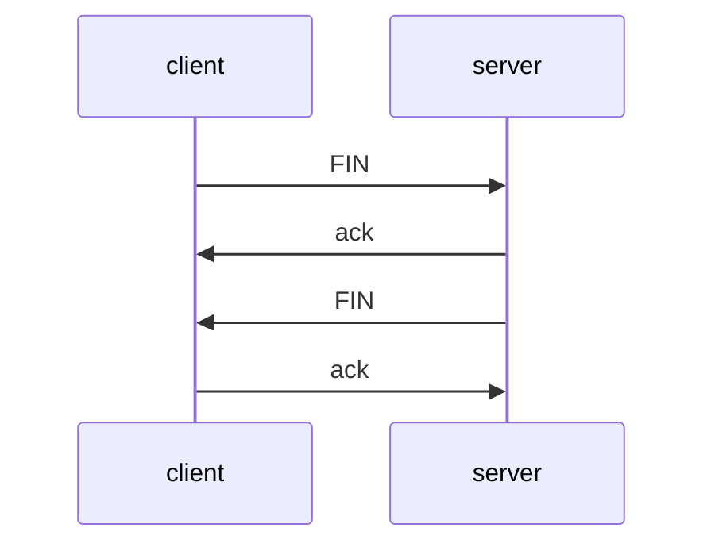

# tcp

transition control protocol

## tcp machine

### time_wait

- time_wait状态是在主动发起关闭端收到fin和ack后产生的
- [有什么作用？](https://blog.huoding.com/2013/12/31/316)简单的说，由于tcp有重传机制，被动方发fin并关闭连接可能会重传，主动方此时如果释放了端口，则会导致被动方收到干扰数据
- 有什么危害？如果一个机器上有很多time_wait的tcp连接，会占用端口号，导致端口号不够用

## 三次握手

### 时序图

## 四次挥手

### 时序图

## 一些缩写

- finite state machine
- syn，syncronize sequence number，同步序列号
- ack，acknowledgment，致谢
- fin，finish，结束
- rst，reset，重置
- psh，push，推送
- urg，urgent，紧急
- isn，initial sequence number，初始化序列号
- msl，max segment lifetime，segment最大传输时间，一般是2.5min